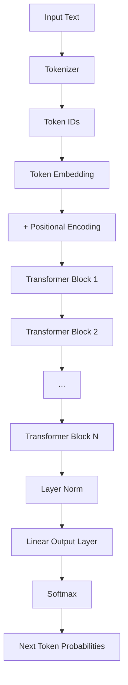
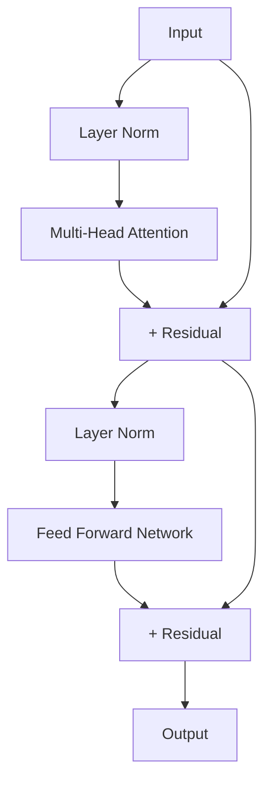

# Design Document: Mini Transformer Phase 1

## Overview

Phase 1では、GPT-2ライクなDecoder-only Transformerをフルスクラッチで実装する。Pythonとpytorchを使用し、各コンポーネントを個別に実装してから組み合わせる。学習目的のため、コードの可読性と理解しやすさを優先する。

### 目標スペック
- パラメータ数: 約2000万〜3000万
- 層数: 6
- 埋め込み次元: 384
- ヘッド数: 6
- コンテキスト長: 256トークン
- 語彙サイズ: 約5000〜10000

### ディレクトリ構成

```
phase1/
├── README.md
├── requirements.txt
├── src/
│   ├── __init__.py
│   ├── tokenizer.py      # Requirement 1
│   ├── embedding.py      # Requirement 2, 3
│   ├── attention.py      # Requirement 4, 5
│   ├── feedforward.py    # Requirement 6
│   ├── transformer.py    # Requirement 7, 8
│   ├── model.py          # 完全なモデル
│   ├── train.py          # Requirement 9
│   ├── generate.py       # Requirement 10
│   └── dataset.py        # Requirement 11
├── tests/
│   └── ...
├── data/
│   └── ...
├── checkpoints/
│   └── ...
└── notebooks/
    └── exploration.ipynb  # 可視化・実験用
```

## Architecture



### Transformer Block 内部構造



## Components and Interfaces

### 1. Tokenizer (tokenizer.py)

シンプルな文字レベルトークナイザーを実装。学習目的のため、BPEなどの複雑なアルゴリズムは使わない。

```python
class CharTokenizer:
    def __init__(self):
        self.char_to_id: dict[str, int]
        self.id_to_char: dict[int, str]
        self.vocab_size: int
        self.special_tokens = {
            '<PAD>': 0,
            '<UNK>': 1,
            '<BOS>': 2,
            '<EOS>': 3
        }
    
    def build_vocab(self, texts: list[str]) -> None:
        """テキストから語彙を構築"""
        pass
    
    def encode(self, text: str) -> list[int]:
        """テキストをトークンIDに変換"""
        pass
    
    def decode(self, ids: list[int]) -> str:
        """トークンIDをテキストに復元"""
        pass
    
    def save(self, path: str) -> None:
        """語彙を保存"""
        pass
    
    def load(self, path: str) -> None:
        """語彙を読み込み"""
        pass
```

### 2. Embedding Layer (embedding.py)

```python
import torch
import torch.nn as nn

class TokenEmbedding(nn.Module):
    def __init__(self, vocab_size: int, embed_dim: int):
        super().__init__()
        self.embedding = nn.Embedding(vocab_size, embed_dim)
    
    def forward(self, x: torch.Tensor) -> torch.Tensor:
        """
        Args:
            x: (batch_size, seq_len) トークンID
        Returns:
            (batch_size, seq_len, embed_dim) 埋め込みベクトル
        """
        return self.embedding(x)
```

### 3. Positional Encoding (embedding.py)

Sinusoidal Positional Encodingを実装。

```python
class PositionalEncoding(nn.Module):
    def __init__(self, embed_dim: int, max_len: int = 512):
        super().__init__()
        # PE(pos, 2i) = sin(pos / 10000^(2i/d_model))
        # PE(pos, 2i+1) = cos(pos / 10000^(2i/d_model))
        pe = torch.zeros(max_len, embed_dim)
        position = torch.arange(0, max_len).unsqueeze(1).float()
        div_term = torch.exp(
            torch.arange(0, embed_dim, 2).float() * 
            (-math.log(10000.0) / embed_dim)
        )
        pe[:, 0::2] = torch.sin(position * div_term)
        pe[:, 1::2] = torch.cos(position * div_term)
        self.register_buffer('pe', pe.unsqueeze(0))
    
    def forward(self, x: torch.Tensor) -> torch.Tensor:
        """
        Args:
            x: (batch_size, seq_len, embed_dim)
        Returns:
            (batch_size, seq_len, embed_dim) 位置情報が加算されたベクトル
        """
        return x + self.pe[:, :x.size(1)]
```

### 4. Self-Attention (attention.py)

Scaled Dot-Product Attentionを実装。

```python
class SelfAttention(nn.Module):
    def __init__(self, embed_dim: int):
        super().__init__()
        self.embed_dim = embed_dim
        self.scale = math.sqrt(embed_dim)
        
        self.query = nn.Linear(embed_dim, embed_dim)
        self.key = nn.Linear(embed_dim, embed_dim)
        self.value = nn.Linear(embed_dim, embed_dim)
    
    def forward(
        self, 
        x: torch.Tensor, 
        mask: torch.Tensor | None = None
    ) -> tuple[torch.Tensor, torch.Tensor]:
        """
        Args:
            x: (batch_size, seq_len, embed_dim)
            mask: (seq_len, seq_len) causal mask
        Returns:
            output: (batch_size, seq_len, embed_dim)
            attention_weights: (batch_size, seq_len, seq_len)
        """
        Q = self.query(x)
        K = self.key(x)
        V = self.value(x)
        
        # Attention scores: (batch, seq_len, seq_len)
        scores = torch.matmul(Q, K.transpose(-2, -1)) / self.scale
        
        if mask is not None:
            scores = scores.masked_fill(mask == 0, float('-inf'))
        
        attention_weights = F.softmax(scores, dim=-1)
        output = torch.matmul(attention_weights, V)
        
        return output, attention_weights
```

### 5. Multi-Head Attention (attention.py)

```python
class MultiHeadAttention(nn.Module):
    def __init__(self, embed_dim: int, num_heads: int):
        super().__init__()
        assert embed_dim % num_heads == 0
        
        self.embed_dim = embed_dim
        self.num_heads = num_heads
        self.head_dim = embed_dim // num_heads
        self.scale = math.sqrt(self.head_dim)
        
        self.q_proj = nn.Linear(embed_dim, embed_dim)
        self.k_proj = nn.Linear(embed_dim, embed_dim)
        self.v_proj = nn.Linear(embed_dim, embed_dim)
        self.out_proj = nn.Linear(embed_dim, embed_dim)
    
    def forward(
        self, 
        x: torch.Tensor, 
        mask: torch.Tensor | None = None
    ) -> tuple[torch.Tensor, torch.Tensor]:
        """
        Args:
            x: (batch_size, seq_len, embed_dim)
            mask: (seq_len, seq_len) causal mask
        Returns:
            output: (batch_size, seq_len, embed_dim)
            attention_weights: (batch_size, num_heads, seq_len, seq_len)
        """
        batch_size, seq_len, _ = x.shape
        
        # Project and reshape to (batch, num_heads, seq_len, head_dim)
        Q = self.q_proj(x).view(batch_size, seq_len, self.num_heads, self.head_dim).transpose(1, 2)
        K = self.k_proj(x).view(batch_size, seq_len, self.num_heads, self.head_dim).transpose(1, 2)
        V = self.v_proj(x).view(batch_size, seq_len, self.num_heads, self.head_dim).transpose(1, 2)
        
        # Attention: (batch, num_heads, seq_len, seq_len)
        scores = torch.matmul(Q, K.transpose(-2, -1)) / self.scale
        
        if mask is not None:
            scores = scores.masked_fill(mask == 0, float('-inf'))
        
        attention_weights = F.softmax(scores, dim=-1)
        
        # (batch, num_heads, seq_len, head_dim)
        context = torch.matmul(attention_weights, V)
        
        # Reshape back: (batch, seq_len, embed_dim)
        context = context.transpose(1, 2).contiguous().view(batch_size, seq_len, self.embed_dim)
        output = self.out_proj(context)
        
        return output, attention_weights
```

### 6. Feed Forward Network (feedforward.py)

```python
class FeedForward(nn.Module):
    def __init__(self, embed_dim: int, ff_dim: int, dropout: float = 0.1):
        super().__init__()
        self.net = nn.Sequential(
            nn.Linear(embed_dim, ff_dim),
            nn.GELU(),
            nn.Dropout(dropout),
            nn.Linear(ff_dim, embed_dim),
            nn.Dropout(dropout)
        )
    
    def forward(self, x: torch.Tensor) -> torch.Tensor:
        """
        Args:
            x: (batch_size, seq_len, embed_dim)
        Returns:
            (batch_size, seq_len, embed_dim)
        """
        return self.net(x)
```

### 7. Transformer Block (transformer.py)

Pre-LN構成を採用（学習が安定しやすい）。

```python
class TransformerBlock(nn.Module):
    def __init__(
        self, 
        embed_dim: int, 
        num_heads: int, 
        ff_dim: int, 
        dropout: float = 0.1
    ):
        super().__init__()
        self.ln1 = nn.LayerNorm(embed_dim)
        self.attention = MultiHeadAttention(embed_dim, num_heads)
        self.ln2 = nn.LayerNorm(embed_dim)
        self.ff = FeedForward(embed_dim, ff_dim, dropout)
        self.dropout = nn.Dropout(dropout)
    
    def forward(
        self, 
        x: torch.Tensor, 
        mask: torch.Tensor | None = None
    ) -> tuple[torch.Tensor, torch.Tensor]:
        """
        Args:
            x: (batch_size, seq_len, embed_dim)
            mask: causal mask
        Returns:
            output: (batch_size, seq_len, embed_dim)
            attention_weights: attention weights for visualization
        """
        # Pre-LN + Attention + Residual
        normed = self.ln1(x)
        attn_out, attn_weights = self.attention(normed, mask)
        x = x + self.dropout(attn_out)
        
        # Pre-LN + FFN + Residual
        normed = self.ln2(x)
        ff_out = self.ff(normed)
        x = x + ff_out
        
        return x, attn_weights
```

### 8. Complete Model (model.py)

```python
class MiniGPT(nn.Module):
    def __init__(self, config: ModelConfig):
        super().__init__()
        self.config = config
        
        self.token_embedding = TokenEmbedding(config.vocab_size, config.embed_dim)
        self.pos_encoding = PositionalEncoding(config.embed_dim, config.max_len)
        self.dropout = nn.Dropout(config.dropout)
        
        self.blocks = nn.ModuleList([
            TransformerBlock(
                config.embed_dim, 
                config.num_heads, 
                config.ff_dim, 
                config.dropout
            )
            for _ in range(config.num_layers)
        ])
        
        self.ln_final = nn.LayerNorm(config.embed_dim)
        self.output = nn.Linear(config.embed_dim, config.vocab_size, bias=False)
        
        # Weight tying: 出力層とEmbeddingの重みを共有
        self.output.weight = self.token_embedding.embedding.weight
    
    def forward(
        self, 
        x: torch.Tensor, 
        return_attention: bool = False
    ) -> torch.Tensor | tuple[torch.Tensor, list]:
        """
        Args:
            x: (batch_size, seq_len) token IDs
            return_attention: attention weightsも返すか
        Returns:
            logits: (batch_size, seq_len, vocab_size)
            attention_weights: (optional) list of attention weights per layer
        """
        seq_len = x.size(1)
        
        # Causal mask
        mask = torch.triu(torch.ones(seq_len, seq_len), diagonal=1).bool()
        mask = ~mask  # True = attend, False = mask
        mask = mask.to(x.device)
        
        # Embedding + Positional Encoding
        x = self.token_embedding(x)
        x = self.pos_encoding(x)
        x = self.dropout(x)
        
        # Transformer blocks
        attention_weights = []
        for block in self.blocks:
            x, attn = block(x, mask)
            if return_attention:
                attention_weights.append(attn)
        
        # Output
        x = self.ln_final(x)
        logits = self.output(x)
        
        if return_attention:
            return logits, attention_weights
        return logits
```

### 9. Model Configuration

```python
@dataclass
class ModelConfig:
    vocab_size: int = 5000
    embed_dim: int = 384
    num_heads: int = 6
    num_layers: int = 6
    ff_dim: int = 1536  # 4 * embed_dim
    max_len: int = 256
    dropout: float = 0.1
```

## Data Models

### Training Configuration

```python
@dataclass
class TrainConfig:
    batch_size: int = 32
    learning_rate: float = 3e-4
    warmup_steps: int = 1000
    max_steps: int = 10000
    eval_interval: int = 500
    save_interval: int = 1000
    grad_clip: float = 1.0
```

### Dataset

```python
class TextDataset(Dataset):
    def __init__(
        self, 
        texts: list[str], 
        tokenizer: CharTokenizer, 
        seq_len: int
    ):
        self.tokenizer = tokenizer
        self.seq_len = seq_len
        self.data = self._prepare_data(texts)
    
    def _prepare_data(self, texts: list[str]) -> torch.Tensor:
        """全テキストをトークン化して連結"""
        all_tokens = []
        for text in texts:
            tokens = self.tokenizer.encode(text)
            all_tokens.extend(tokens)
        return torch.tensor(all_tokens, dtype=torch.long)
    
    def __len__(self) -> int:
        return (len(self.data) - 1) // self.seq_len
    
    def __getitem__(self, idx: int) -> tuple[torch.Tensor, torch.Tensor]:
        start = idx * self.seq_len
        end = start + self.seq_len
        x = self.data[start:end]
        y = self.data[start+1:end+1]  # 次のトークンを予測
        return x, y
```


## Correctness Properties

*A property is a characteristic or behavior that should hold true across all valid executions of a system-essentially, a formal statement about what the system should do. Properties serve as the bridge between human-readable specifications and machine-verifiable correctness guarantees.*

### Property 1: Tokenizer Round Trip

*For any* 有効なテキスト文字列（語彙に含まれる文字のみで構成）, エンコードしてデコードした結果は元のテキストと等価である。

```python
# encode(decode(text)) == text
```

**Validates: Requirements 1.2, 1.4**

### Property 2: Embedding Output Shape

*For any* バッチサイズB、シーケンス長S、埋め込み次元Dに対して、TokenEmbeddingの出力形状は(B, S, D)である。

```python
# embedding(x).shape == (batch_size, seq_len, embed_dim)
```

**Validates: Requirements 2.1, 2.3**

### Property 3: Positional Encoding Uniqueness

*For any* 2つの異なる位置i, j (i ≠ j)に対して、Positional Encodingは異なるベクトルを生成する。

```python
# pe[i] != pe[j] for all i != j
```

**Validates: Requirements 3.3**

### Property 4: Positional Encoding Shape Preservation

*For any* 入力テンソル(B, S, D)に対して、Positional Encodingの出力形状は同じ(B, S, D)である。

```python
# pos_encoding(x).shape == x.shape
```

**Validates: Requirements 3.1**

### Property 5: Attention Weights Sum to One

*For any* 入力に対して、Self-AttentionのAttention重みの各行は確率分布（合計が1）である。

```python
# attention_weights.sum(dim=-1) ≈ 1.0
```

**Validates: Requirements 4.2**

### Property 6: Causal Mask Prevents Future Attention

*For any* シーケンス長Sに対して、Causal Maskが適用された場合、位置iのトークンは位置j > iのトークンに対するAttention重みが0である。

```python
# attention_weights[i, j] == 0 for all j > i
```

**Validates: Requirements 4.3**

### Property 7: Multi-Head Attention Output Shape

*For any* 入力(B, S, D)とヘッド数Hに対して、Multi-Head Attentionの出力形状は(B, S, D)、Attention重みの形状は(B, H, S, S)である。

```python
# output.shape == (B, S, D)
# attention_weights.shape == (B, H, S, S)
```

**Validates: Requirements 5.1, 5.2**

### Property 8: Feed Forward Shape Preservation

*For any* 入力(B, S, D)に対して、Feed Forward Networkの出力形状は同じ(B, S, D)である。

```python
# ff(x).shape == x.shape
```

**Validates: Requirements 6.1, 6.3**

### Property 9: Transformer Block Residual Connection

*For any* 入力xに対して、Transformer Blockの出力は入力の情報を保持する（勾配が流れる）。ゼロ初期化されたAttentionとFFNの場合、出力は入力と等しい。

```python
# 残差接続により、block(x) ≈ x when attention and ff are zero-initialized
```

**Validates: Requirements 7.2**

### Property 10: Model Output is Probability Distribution

*For any* 入力シーケンスに対して、モデル出力にsoftmaxを適用した結果は確率分布（各位置で合計1）である。

```python
# softmax(logits, dim=-1).sum(dim=-1) ≈ 1.0
```

**Validates: Requirements 8.3**

### Property 11: Learning Rate Schedule

*For any* 学習ステップtに対して、学習率はwarmup期間中は増加し、その後は減少する。

```python
# lr(t) < lr(t+1) for t < warmup_steps
# lr(t) > lr(t+1) for t > warmup_steps
```

**Validates: Requirements 9.4**

### Property 12: Checkpoint Round Trip

*For any* モデル状態に対して、保存して読み込んだ結果は元の状態と等価である。

```python
# load(save(model_state)) == model_state
```

**Validates: Requirements 9.5**

### Property 13: Autoregressive Generation Length

*For any* プロンプトと最大生成長max_lenに対して、生成されたシーケンスの長さはlen(prompt) + max_len以下である。

```python
# len(generated) <= len(prompt) + max_len
```

**Validates: Requirements 10.1, 10.4**

### Property 14: Temperature Sampling Determinism

*For any* 入力に対して、Temperature=0（またはgreedy）の場合、同じ入力に対して常に同じ出力が生成される。

```python
# generate(prompt, temp=0) == generate(prompt, temp=0)
```

**Validates: Requirements 10.2**

### Property 15: Top-k Sampling Constraint

*For any* 入力とk値に対して、Top-kサンプリングは上位k個のトークンからのみ選択する。k=1の場合、最も確率の高いトークンが選択される。

```python
# sampled_token in top_k_tokens(logits, k)
```

**Validates: Requirements 10.3**

### Property 16: Dataset Fixed Length

*For any* データセットのサンプルに対して、入力シーケンスと出力シーケンスの長さは設定されたseq_lenと等しい。

```python
# len(x) == seq_len and len(y) == seq_len for all (x, y) in dataset
```

**Validates: Requirements 11.2**

### Property 17: DataLoader Batch Shape

*For any* バッチサイズBとシーケンス長Sに対して、DataLoaderから取得したバッチの形状は(B, S)である。

```python
# batch_x.shape == (B, S) and batch_y.shape == (B, S)
```

**Validates: Requirements 11.3**

## Error Handling

### Tokenizer Errors
- 空文字列入力: 空のトークンリストを返す
- 未知文字: `<UNK>`トークンに置換

### Model Errors
- 無効なトークンID（vocab_size以上）: IndexError
- シーケンス長がmax_lenを超過: 切り詰めまたはエラー

### Training Errors
- NaN損失: 学習率を下げて再試行、またはgradient clippingを強化
- メモリ不足: バッチサイズを削減

### Generation Errors
- 無限ループ防止: 最大生成長で強制終了
- 無効なTemperature（負の値）: ValueError

## Testing Strategy

### Property-Based Testing

pytestとhypothesisを使用してプロパティベーステストを実装する。

```python
# pytest + hypothesis
pip install pytest hypothesis
```

各プロパティテストは最低100回のイテレーションを実行する。

### Unit Tests

- 各コンポーネントの基本動作確認
- エッジケース（空入力、単一要素など）
- エラーハンドリングの確認

### Integration Tests

- 全コンポーネントを組み合わせた動作確認
- 小規模データでの学習→生成の一連の流れ

### Test Organization

```
tests/
├── test_tokenizer.py      # Property 1
├── test_embedding.py      # Property 2
├── test_positional.py     # Property 3, 4
├── test_attention.py      # Property 5, 6, 7
├── test_feedforward.py    # Property 8
├── test_transformer.py    # Property 9
├── test_model.py          # Property 10
├── test_training.py       # Property 11, 12
├── test_generation.py     # Property 13, 14, 15
└── test_dataset.py        # Property 16, 17
```
